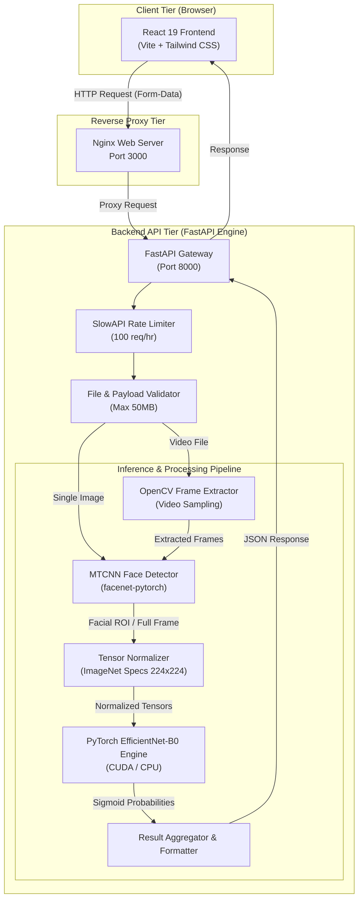
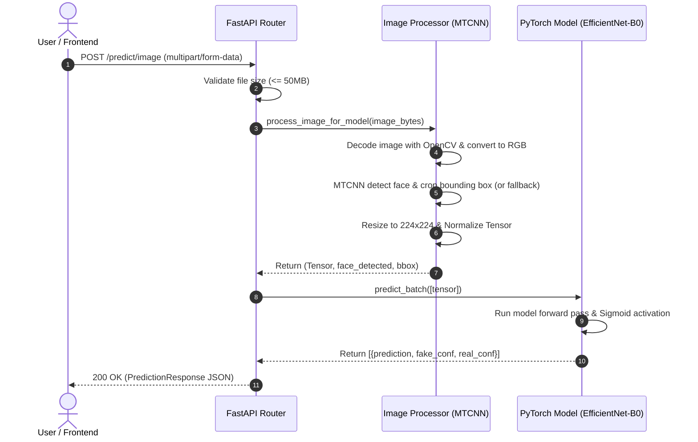
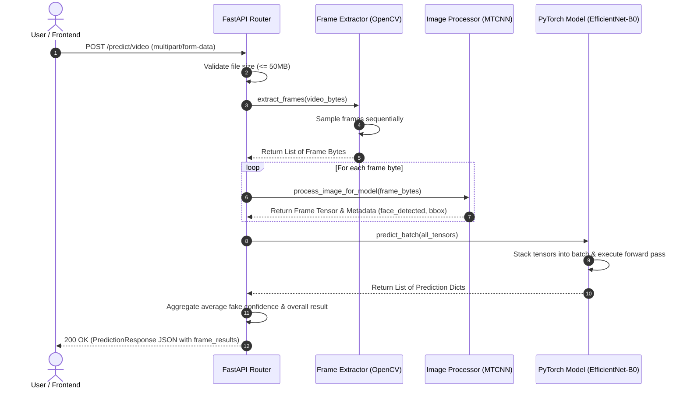

# Deepfake Detector


**Deepfake Detector** is an end-to-end, high-performance web application engineered to detect synthetic media and deepfakes across images and videos. The application pairs a modern, responsive React UI with a Python-based FastAPI backend that utilizes **MTCNN** face detection and a **PyTorch EfficientNet-B0** deep learning pipeline for fast, accurate inference.

---

## Key Features

- 📸 **Image Deepfake Detection:** Instant analysis of single image uploads with facial ROI (Region of Interest) extraction and prediction scores.
- 🎥 **Video Frame-by-Frame Processing:** Automated frame sampling via OpenCV, bounding box detection, and batch inference to analyze video manipulation.
- 🎯 **MTCNN Face Cropping:** Intelligent face localization that isolates facial features before feeding normalized tensors into the neural network.
- ⚡ **Batch PyTorch Inference:** Efficient tensor batching and optional GPU (CUDA) acceleration for low-latency scoring.
- 📊 **Detailed Metrics & Visual Breakdown:** View overall prediction (`REAL` vs `FAKE`), confidence percentages, processing times (ms), and frame-level confidence stats.
- 🛡️ **Rate Limiting & Validation:** Built-in SlowAPI rate limiting (100 req/hr) and dynamic file size check (up to 50MB).
- 🐳 **Docker & Microservices Ready:** Pre-configured `docker-compose.yml` orchestrating Nginx, React, and FastAPI services.

---

## Architecture Diagram

The system operates across three tiers: a **React Frontend**, a **FastAPI Gateway**, and a **PyTorch Deep Learning Engine**.



---

## API Flow Diagrams

### 1. Image Prediction Flow (`POST /predict/image`)



### 2. Video Batch Processing Flow (`POST /predict/video`)



---

## API Documentation

### 1. Health Check

Checks backend status and active inference device (CPU or CUDA GPU).

- **Endpoint:** `GET /health`
- **Response `200 OK`:**
  ```json
  {
    "status": "healthy",
    "device": "cuda"
  }
  ```

---

### 2. Predict Image

Uploads a single image for deepfake evaluation.

- **Endpoint:** `POST /predict/image`
- **Content-Type:** `multipart/form-data`
- **Parameters:**
  - `file` *(file, required)*: Image file (`.png`, `.jpg`, `.jpeg`, `.webp`).
- **Response `200 OK`:**
  ```json
  {
    "overall_prediction": "REAL",
    "fake_confidence": 12.45,
    "real_confidence": 87.55,
    "frames_analyzed": 1,
    "processing_time_ms": 185,
    "frame_results": [
      {
        "frame_index": 0,
        "prediction": "REAL",
        "fake_confidence": 12.45,
        "real_confidence": 87.55,
        "face_detected": true,
        "face_bbox": [120.0, 85.0, 310.0, 290.0]
      }
    ],
    "message": "Image analyzed successfully."
  }
  ```

---

### 3. Predict Video

Uploads a video for frame extraction and batch deepfake analysis.

- **Endpoint:** `POST /predict/video`
- **Content-Type:** `multipart/form-data`
- **Parameters:**
  - `file` *(file, required)*: Video file (`.mp4`, `.avi`, `.mov`).
- **Response `200 OK`:**
  ```json
  {
    "overall_prediction": "FAKE",
    "fake_confidence": 92.10,
    "real_confidence": 7.90,
    "frames_analyzed": 15,
    "processing_time_ms": 1420,
    "frame_results": [
      {
        "frame_index": 0,
        "prediction": "FAKE",
        "fake_confidence": 94.20,
        "real_confidence": 5.80,
        "face_detected": true,
        "face_bbox": [105.0, 70.0, 300.0, 280.0]
      }
    ],
    "message": "14/15 frames detected as fake"
  }
  ```

---

## Tech Stack Overview

| Component | Technology | Description |
| :--- | :--- | :--- |
| **Frontend UI** | React 19 + Vite | SPA framework offering high performance and instant dev builds. |
| **Styling** | Tailwind CSS | Modern utility-first CSS design system. |
| **Icons** | Lucide React | Clean, responsive icon set. |
| **Backend Framework**| FastAPI | High-performance Python ASGI web framework. |
| **Server** | Uvicorn | Lightning-fast ASGI server implementation. |
| **Deep Learning** | PyTorch | Model inference and batch execution. |
| **Model Backbone** | EfficientNet-B0 | Pretrained feature extractor via `timm`. |
| **Face Detection** | MTCNN | `facenet-pytorch` multi-task cascaded convolutional network. |
| **Computer Vision** | OpenCV + PIL | Image decoding, color transformation, and video frame extraction. |
| **Rate Limiting** | SlowAPI | Request throttling middleware. |
| **Containerization** | Docker & Docker Compose | Multi-container environment orchestration. |

---

## Project Structure

```
Deepfake-Detector/
├── docker-compose.yml       # Multi-container orchestration (Backend + Frontend)
├── README.md                # Project documentation & architecture guides
├── LICENSE                  # MIT License
│
├── backend/                 # Python FastAPI Backend
│   ├── Dockerfile           # Backend container image build spec
│   ├── requirements.txt     # Python dependencies (PyTorch, FastAPI, OpenCV, etc.)
│   ├── app/
│   │   ├── main.py          # FastAPI application entry point, CORS & lifespan rules
│   │   ├── core/
│   │   │   └── config.py    # Environment settings & Pydantic configurations
│   │   ├── models/          # Trained model weights directory (.pt/.pth files)
│   │   ├── routes/
│   │   │   └── predict.py   # REST API endpoint definitions (/predict/image, /predict/video)
│   │   ├── schemas/
│   │   │   └── request.py   # Pydantic data schemas & response DTOs
│   │   ├── services/
│   │   │   └── inference.py # Model loading, PyTorch batch inference logic
│   │   └── utils/
│   │       ├── image.py     # Image loading, MTCNN face detection & preprocessing
│   │       └── video.py     # OpenCV video frame sampler
│   └── tests/               # Backend unit and integration test suite
│
└── frontend/                # React Frontend Application
    ├── Dockerfile           # Multi-stage production build container spec (Nginx)
    ├── nginx.conf           # Nginx reverse proxy configuration
    ├── package.json         # Node.js dependencies & scripts
    ├── vite.config.js       # Vite bundler configuration & dev server proxies
    ├── tailwind.config.js   # Tailwind design tokens & settings
    └── src/
        ├── App.jsx          # Root application component & routing
        ├── main.jsx         # DOM mount entry point
        ├── components/      # Modular UI components (ResultCard, Upload, Loader, etc.)
        ├── pages/           # Page routes (Home, Dashboard)
        └── services/
            └── api.js       # Axios/Fetch client for FastAPI communication
```

---

## Environment Configuration

### Backend Configuration (`backend/app/core/config.py`)

| Variable Name | Default Value | Description |
| :--- | :--- | :--- |
| `MODEL_PATH` | `app/models/model_v3.pt` | Path to PyTorch model state dict file. |
| `DEVICE` | `cuda` | Target compute device (`cuda` or `cpu`). |
| `MAX_FILE_SIZE_MB` | `50` | Maximum upload limit in Megabytes. |
| `MAX_VIDEO_FRAMES` | `20` | Max number of frames to extract from video. |
| `MIN_VIDEO_FRAMES` | `10` | Min frame threshold for video evaluation. |
| `FACE_MIN_SIZE` | `80` | Minimum pixel height/width for face detection. |
| `RATE_LIMIT` | `100/hour` | API rate limit per remote IP address. |

### Frontend Configuration (`frontend/.env`)

| Variable Name | Default Value | Description |
| :--- | :--- | :--- |
| `VITE_API_URL` | `/api` | Base URL endpoint for FastAPI backend services. |

---

## Getting Started & Setup Guide

### Prerequisites

Ensure you have the following software installed locally:
- **Node.js** (v18.0.0 or higher) & `npm`
- **Python** (v3.10 or higher)
- **Docker** & **Docker Compose** *(Optional, for containerized execution)*

---

### Option 1: Run with Docker Compose (Recommended)

1. Clone the repository:
   ```bash
   git clone https://github.com/KunalTechs/Deepfake-Detector.git
   cd Deepfake-Detector
   ```

2. Build and start all services:
   ```bash
   docker-compose up --build
   ```

3. Access the applications:
   - **Frontend UI:** `http://localhost:3000`
   - **Backend API:** `http://localhost:8000`
   - **Swagger Docs:** `http://localhost:8000/docs`

---

### Option 2: Local Development Setup

#### 1. Backend Setup

```bash
cd backend

# Create virtual environment
python -m venv venv

# Activate virtual environment
# On Linux/macOS:
source venv/bin/activate
# On Windows (PowerShell):
.\venv\Scripts\Activate.ps1

# Install requirements
pip install -r requirements.txt

# Start FastAPI server
uvicorn app.main:app --host 0.0.0.0 --port 8000 --reload
```

#### 2. Frontend Setup

```bash
cd frontend

# Install Node dependencies
npm install

# Start Vite dev server
npm run dev
```
Open `http://localhost:5173` in your browser.

---

## License

Distributed under the MIT License. See [`LICENSE`](LICENSE) for more details.
