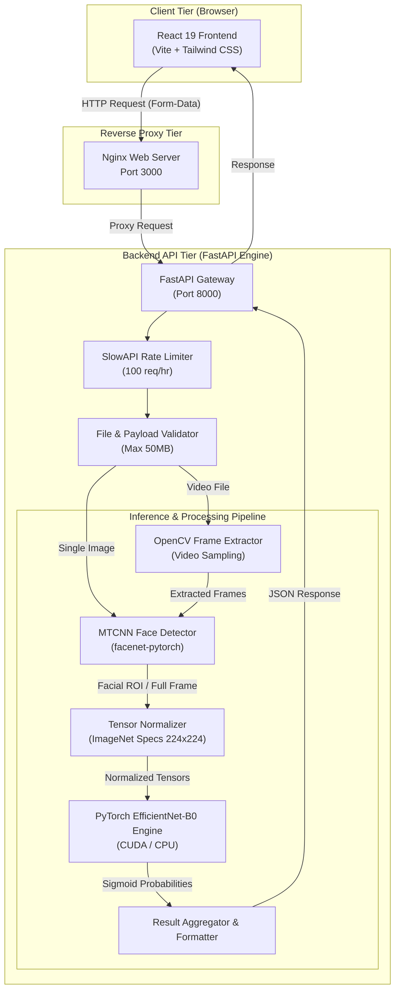
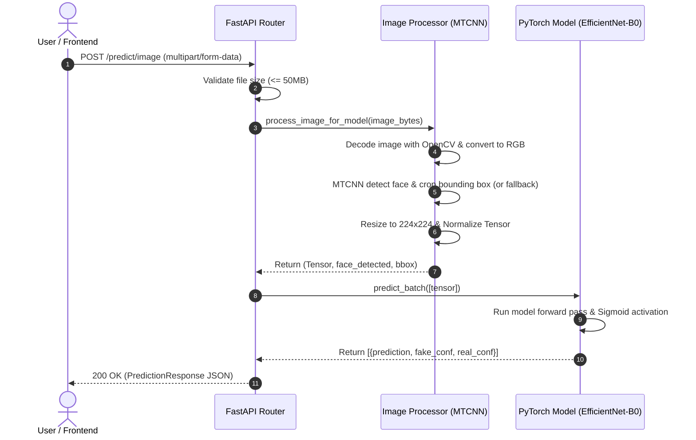
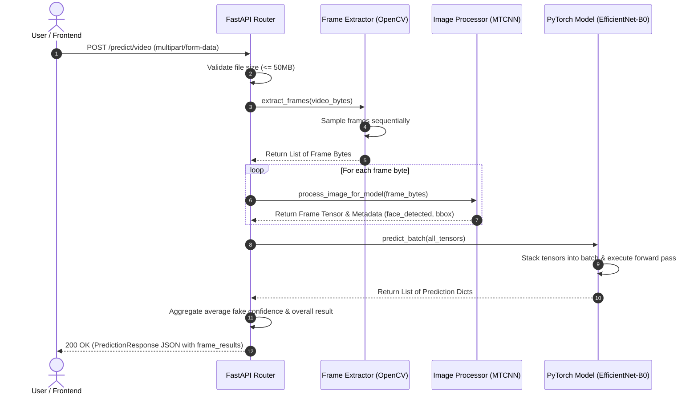

# Deepfake Detector

     

**Deepfake Detector** is an end-to-end, high-performance web application engineered to detect synthetic media and deepfakes across images and videos. The application pairs a modern, responsive React UI with a Python-based FastAPI backend that utilizes MTCNN face detection and a PyTorch EfficientNet-B0 deep learning pipeline for fast, accurate inference.

The model is trained on a combined **80,000-frame** dataset from **Celeb-DF v2** and **FaceForensics++**, achieving **98.98% validation accuracy** and an **AUC-ROC of 0.9992**, with **zero missed deepfakes** (perfect FAKE-class recall) on the validation set.

---

## 🏆 Model Performance

| Metric | Value |
|---|---|
| **Validation Accuracy** | **98.98%** |
| **AUC-ROC Score** | **0.9992** |
| **Precision (FAKE class)** | 99.26% |
| **Recall (FAKE class)** | 100.0% (zero false negatives) |
| **F1 Score (FAKE class)** | 99.63% |
| **False Positive Rate** | 0.75% (3 out of 396 real samples) |
| **Train–Val Accuracy Gap** | 0.44% (negligible overfitting) |
| **Training Time** | 46.5 minutes (Kaggle T4×2 GPU, 15 epochs) |
| **CPU Inference (image)** | ~136 ms |
| **CPU Inference (video, 20 frames)** | 3–9 seconds |

### Confusion Matrix (4,008-sample validation set)

| | Predicted REAL | Predicted FAKE |
|---|---|---|
| **Actual REAL** | 393 (TN) | 3 (FP) |
| **Actual FAKE** | 0 (FN) | 404 (TP) |

> Zero false negatives means the model never missed a deepfake in validation — the most critical property for a safety-oriented detection system.

### Benchmark vs. Published Work

| Authors | Year | Method | Dataset | Val. Accuracy |
|---|---|---|---|---|
| Rossler et al. | 2019 | XceptionNet | FaceForensics++ | 95.7% |
| Li et al. | 2020 | Two-branch Network | Celeb-DF | 86.1% |
| Zhao et al. | 2021 | Multi-attentional CNN | FF++ + DFDC | 88.7% |
| Nguyen et al. | 2022 | ViT Detector | Multiple Datasets | 91.2% |
| Dong et al. | 2023 | CLIP-based Detection | DFDC + CelebDF | 93.4% |
| **This Work** | **2026** | **EfficientNet-B0** | **Celeb-DF v2 + FF++** | **98.98%** |

EfficientNet-B0 achieves this while using only **5.3M parameters** — roughly a quarter the size of XceptionNet's 22.9M — making it practical for CPU-only deployment.

---

## 📊 Dataset

| Dataset | Videos | Real Frames | Fake Frames | Notes |
|---|---|---|---|---|
| Celeb-DF v2 | 590 (300 real + 290 fake) | 20,031 | 20,565 | High-quality identity-swap GAN, 59 celebrities, 1080p |
| FaceForensics++ | 2,000 (1,000 real + 1,000 fake) | 20,000 | 20,000 | c23 compression; DeepFakes, FaceSwap, Face2Face, NeuralTextures |
| **Combined Total** | **2,590** | **20,031** | **20,031 (capped/balanced)** | **40,062 frames total** |

**Split:** 90% training (36,054 frames) / 10% validation (4,008 frames), performed **at the video level** (not frame level) to prevent data leakage — all frames from a given video stay entirely in one split.

**Preprocessing:** Faces extracted via **MTCNN** (P-Net → R-Net → O-Net cascade) with a 20px margin, cropped/resized to 224×224px for EfficientNet-B0 input.

**Training augmentations:** Random horizontal flip, ±10° rotation, color jitter, Gaussian blur (p=0.3), random erasing (p=0.1). Validation used only resize + normalize (no augmentation).

---

## 🧠 Model Architecture

- **Backbone:** EfficientNet-B0 (ImageNet-pretrained, via `timm`), 5.3M parameters, 7 MBConv blocks with Squeeze-and-Excitation attention
- **Classification head:** `Dropout(0.3) → Linear(1280→1) → Sigmoid` (binary fake-probability score in [0, 1])
- **Fine-tuning:** Full end-to-end fine-tuning (no frozen layers)
- **Decision threshold:** 0.5 (scores above → FAKE, at/below → REAL)

### Training Configuration

| Hyperparameter | Value |
|---|---|
| Optimizer | AdamW |
| Learning Rate | 1×10⁻⁴ |
| Weight Decay | 1×10⁻⁴ |
| LR Scheduler | CosineAnnealingLR (T_max=15) |
| Loss Function | BCEWithLogitsLoss |
| Batch Size | 32 |
| Max Epochs | 15 (early stopping, patience=3) |
| Gradient Clipping | max_norm=1.0 |
| Early Stopping Metric | Validation AUC-ROC |
| Platform | Kaggle, NVIDIA T4×2 GPU (16GB VRAM each) |
| Best Checkpoint | Epoch 12 (AUC 0.9992), saved as `model_v3.pt` (~20MB) |

### Per-Epoch Training Results (highlights)

| Epoch | Train Loss | Train Acc | Val Acc | AUC-ROC |
|---|---|---|---|---|
| 1 | 0.3618 | 82.72% | 91.25% | 0.9724 |
| 6 | 0.0527 | 98.24% | 98.12% | 0.9977 |
| **12 ★ (best)** | **0.0188** | **99.42%** | **98.98%** | **0.9992** |
| 15 (early stop) | 0.0163 | 99.55% | 98.85% | 0.9990 |

---

## Key Features

- 📸 **Image Deepfake Detection:** Instant analysis of single image uploads with facial ROI (Region of Interest) extraction and prediction scores.
- 🎥 **Video Frame-by-Frame Processing:** Automated frame sampling via OpenCV, bounding box detection, and batch inference to analyze video manipulation.
- 🎯 **MTCNN Face Cropping:** Intelligent face localization that isolates facial features before feeding normalized tensors into the neural network.
- ⚡ **Batch PyTorch Inference:** Efficient tensor batching and optional GPU (CUDA) acceleration for low-latency scoring.
- 📊 **Detailed Metrics & Visual Breakdown:** View overall prediction (REAL vs FAKE), confidence percentages, processing times (ms), and frame-level confidence stats.
- 🛡️ **Rate Limiting & Validation:** Built-in SlowAPI rate limiting (100 req/hr) and dynamic file size check (up to 50MB).
- 🐳 **Docker & Microservices Ready:** Pre-configured `docker-compose.yml` orchestrating Nginx, React, and FastAPI services.

## Architecture Diagram

The system operates across three tiers: a React Frontend, a FastAPI Gateway, and a PyTorch Deep Learning Engine.



## API Flow Diagrams

**1. Image Prediction Flow (`POST /predict/image`)**



**2. Video Batch Processing Flow (`POST /predict/video`)**



## API Documentation

### 1. Health Check
Checks backend status and active inference device (CPU or CUDA GPU).

- **Endpoint:** `GET /health`
- **Response 200 OK:**
```json
{
  "status": "healthy",
  "device": "cuda"
}
```

### 2. Predict Image
Uploads a single image for deepfake evaluation.

- **Endpoint:** `POST /predict/image`
- **Content-Type:** `multipart/form-data`
- **Parameters:** `file` (required) — Image file (`.png`, `.jpg`, `.jpeg`, `.webp`)
- **Response 200 OK:**
```json
{
  "overall_prediction": "REAL",
  "fake_confidence": 12.45,
  "real_confidence": 87.55,
  "frames_analyzed": 1,
  "processing_time_ms": 185,
  "frame_results": [
    {
      "frame_index": 0,
      "prediction": "REAL",
      "fake_confidence": 12.45,
      "real_confidence": 87.55,
      "face_detected": true,
      "face_bbox": [120.0, 85.0, 310.0, 290.0]
    }
  ],
  "message": "Image analyzed successfully."
}
```

### 3. Predict Video
Uploads a video for frame extraction and batch deepfake analysis.

- **Endpoint:** `POST /predict/video`
- **Content-Type:** `multipart/form-data`
- **Parameters:** `file` (required) — Video file (`.mp4`, `.avi`, `.mov`)
- **Response 200 OK:**
```json
{
  "overall_prediction": "FAKE",
  "fake_confidence": 92.10,
  "real_confidence": 7.90,
  "frames_analyzed": 15,
  "processing_time_ms": 1420,
  "frame_results": [
    {
      "frame_index": 0,
      "prediction": "FAKE",
      "fake_confidence": 94.20,
      "real_confidence": 5.80,
      "face_detected": true,
      "face_bbox": [105.0, 70.0, 300.0, 280.0]
    }
  ],
  "message": "14/15 frames detected as fake"
}
```

## Tech Stack Overview

| Component | Technology | Description |
|---|---|---|
| Frontend UI | React 19 + Vite | SPA framework offering high performance and instant dev builds |
| Styling | Tailwind CSS | Modern utility-first CSS design system |
| Icons | Lucide React | Clean, responsive icon set |
| Backend Framework | FastAPI | High-performance Python ASGI web framework |
| Server | Uvicorn | Lightning-fast ASGI server implementation |
| Deep Learning | PyTorch | Model inference and batch execution |
| Model Backbone | EfficientNet-B0 | Pretrained feature extractor via `timm` |
| Face Detection | MTCNN | `facenet-pytorch` multi-task cascaded convolutional network |
| Computer Vision | OpenCV + PIL | Image decoding, color transformation, and video frame extraction |
| Rate Limiting | SlowAPI | Request throttling middleware |
| Containerization | Docker & Docker Compose | Multi-container environment orchestration |

## Project Structure

```
Deepfake-Detector/
├── docker-compose.yml       # Multi-container orchestration (Backend + Frontend)
├── README.md                # Project documentation & architecture guides
├── LICENSE                  # MIT License
│
├── backend/                 # Python FastAPI Backend
│   ├── Dockerfile           # Backend container image build spec
│   ├── requirements.txt     # Python dependencies (PyTorch, FastAPI, OpenCV, etc.)
│   ├── app/
│   │   ├── main.py          # FastAPI application entry point, CORS & lifespan rules
│   │   ├── core/
│   │   │   └── config.py    # Environment settings & Pydantic configurations
│   │   ├── models/          # Trained model weights directory (.pt/.pth files)
│   │   ├── routes/
│   │   │   └── predict.py   # REST API endpoint definitions (/predict/image, /predict/video)
│   │   ├── schemas/
│   │   │   └── request.py   # Pydantic data schemas & response DTOs
│   │   ├── services/
│   │   │   └── inference.py # Model loading, PyTorch batch inference logic
│   │   └── utils/
│   │       ├── image.py     # Image loading, MTCNN face detection & preprocessing
│   │       └── video.py     # OpenCV video frame sampler
│   └── tests/               # Backend unit and integration test suite
│
└── frontend/                # React Frontend Application
    ├── Dockerfile           # Multi-stage production build container spec (Nginx)
    ├── nginx.conf           # Nginx reverse proxy configuration
    ├── package.json         # Node.js dependencies & scripts
    ├── vite.config.js       # Vite bundler configuration & dev server proxies
    ├── tailwind.config.js   # Tailwind design tokens & settings
    └── src/
        ├── App.jsx          # Root application component & routing
        ├── main.jsx         # DOM mount entry point
        ├── components/      # Modular UI components (ResultCard, Upload, Loader, etc.)
        ├── pages/           # Page routes (Home, Dashboard)
        └── services/
            └── api.js       # Axios/Fetch client for FastAPI communication
```

## Environment Configuration

### Backend Configuration (`backend/app/core/config.py`)

| Variable Name | Default Value | Description |
|---|---|---|
| `MODEL_PATH` | `app/models/model_v3.pt` | Path to PyTorch model state dict file |
| `DEVICE` | `cuda` | Target compute device (`cuda` or `cpu`) |
| `MAX_FILE_SIZE_MB` | `50` | Maximum upload limit in Megabytes |
| `MAX_VIDEO_FRAMES` | `20` | Max number of frames to extract from video |
| `MIN_VIDEO_FRAMES` | `10` | Min frame threshold for video evaluation |
| `FACE_MIN_SIZE` | `80` | Minimum pixel height/width for face detection |
| `RATE_LIMIT` | `100/hour` | API rate limit per remote IP address |

### Frontend Configuration (`frontend/.env`)

| Variable Name | Default Value | Description |
|---|---|---|
| `VITE_API_URL` | `/api` | Base URL endpoint for FastAPI backend services |

## Getting Started & Setup Guide

### Prerequisites

- Node.js (v18.0.0 or higher) & npm
- Python (v3.10 or higher)
- Docker & Docker Compose (optional, for containerized execution)

### Option 1: Run with Docker Compose (Recommended)

```bash
git clone https://github.com/KunalTechs/Deepfake-Detector.git
cd Deepfake-Detector
docker-compose up --build
```

Access the applications:
- **Frontend UI:** http://localhost:3000
- **Backend API:** http://localhost:8000
- **Swagger Docs:** http://localhost:8000/docs

### Option 2: Local Development Setup

**1. Backend Setup**
```bash
cd backend

# Create virtual environment
python -m venv venv

# Activate virtual environment
# On Linux/macOS:
source venv/bin/activate
# On Windows (PowerShell):
.\venv\Scripts\Activate.ps1

# Install requirements
pip install -r requirements.txt

# Start FastAPI server
uvicorn app.main:app --host 0.0.0.0 --port 8000 --reload
```

**2. Frontend Setup**
```bash
cd frontend

# Install Node dependencies
npm install

# Start Vite dev server
npm run dev
```

Open http://localhost:5173 in your browser.

## Limitations

- **Diffusion-based deepfakes:** Trained only on GAN-based datasets; estimated accuracy of ~55–60% on diffusion-generated content (e.g., HeyGen, Runway Gen-2), which leaves different spectral fingerprints.
- **Heavy compression:** Accuracy drops to an estimated ~70–75% on heavily compressed social-media video (WhatsApp, TikTok, Instagram).
- **Face-swap only:** Does not detect audio deepfakes, voice cloning, expression-only reenactment, or full-body/non-facial manipulation.
- **CPU-only deployment:** Default Docker setup uses CPU inference (3–9s per video); GPU deployment would reduce this to sub-second.

## Future Work

- Expand training data with DFDC and WildDeepfake for broader cross-domain generalization
- Add a frequency-domain (DCT/FFT) analysis branch to catch diffusion-based artifacts
- Upgrade backbone to EfficientNet-B4 or ViT-Base for compressed-video robustness
- Add CUDA GPU Docker support for sub-second video inference
- Add Grad-CAM heatmap visualization for interpretability
- Add confidence calibration (temperature/Platt scaling)
- Multi-modal detection combining audio and video analysis

## References

Key sources: Rossler et al. (FaceForensics++, ICCV 2019); Li et al. (Celeb-DF, CVPR 2020); Tan & Le (EfficientNet, ICML 2019); Zhang et al. (MTCNN, 2016); Goodfellow et al. (GANs, NeurIPS 2014). Full reference list available in the project report.

## License

Distributed under the MIT License. See `LICENSE` for more details.
